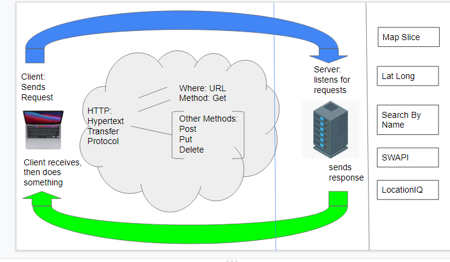

# Lab 07 - City Explorer

**Author**: Tyler Johnson
**Version**:

## Overview
This application will allow a user to search for a city and return information about that city. 

## Getting Started
Possibly draw a wireframe of the site to list necessary components like forms and buttons. Find and connect necessary resources such as LocationIQ via API's

## Architecture
<!-- Provide a detailed description of the application design. What technologies (languages, libraries, etc) you're using, and any other relevant design information. -->

## Change Log
<!-- Use this area to document the iterative changes made to your application as each feature is successfully implemented. Use time stamps. Here's an example:

01-01-2001 4:59pm - Application now has a fully-functional express server, with a GET route for the location resource. -->

## Credit and Collaborations
<!-- Give credit (and a link) to other people or resources that helped you build this application. -->