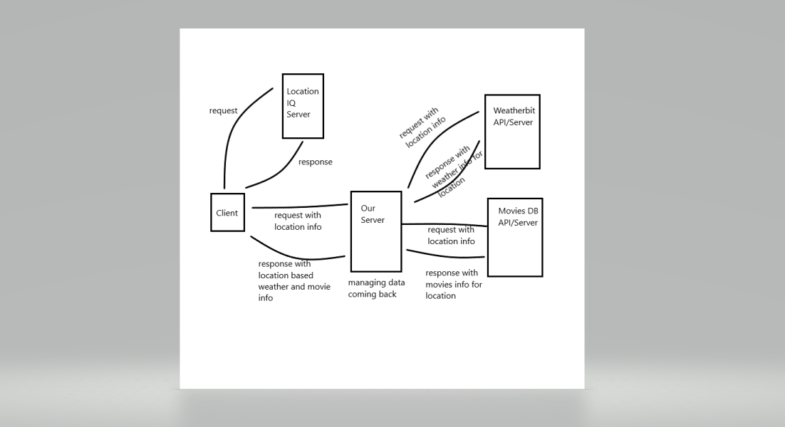

# Lab 07 - City Explorer

**Author**: Tyler Johnson
**Version**:

## Overview
This application will allow a user to search for a city and return information about that city. 

## Getting Started
First npm init, install dependencies, create .env

## Architecture

## Change Log
4/22/21 - App now displays map, weather, and movie info based on city searched. 

## Credit and Collaborations
<!-- Give credit (and a link) to other people or resources that helped you build this application. -->